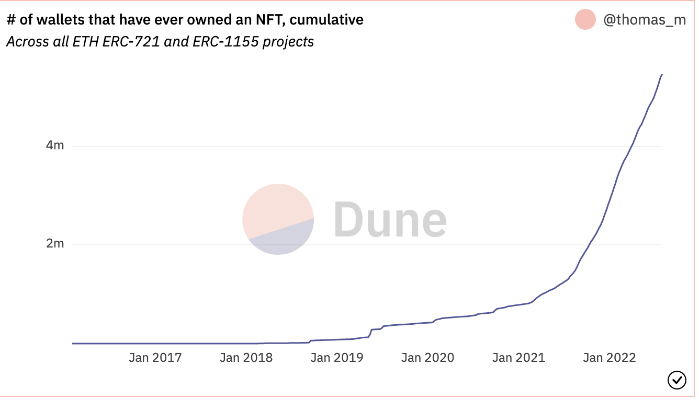
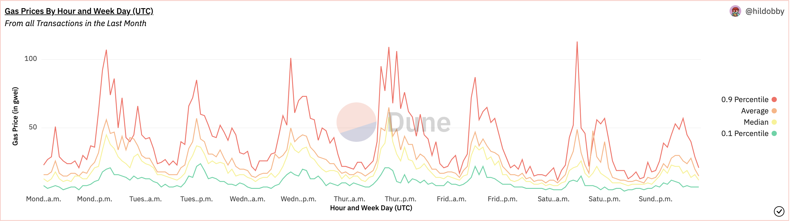

### Notes
# Sprint 0.5

### Readings
Chapter 1,2 [Sayama]

### Session Questions and answers
[Q&A cryptpad](https://cryptpad.fr)

### Goals
 - Recap last week
 - Describe what is a model
 - What are the limits of a model
 - Create a model from observation 

### Topic Discussion Suggestions
- What do we want to get out of the group?
- Setup for python environment
- Jupyter notebook intro 
- Cadcad intro installation

### Practice (Group Exercise)
Looking at the growth of the NFT market how would we go about creating a very simple model to describe this market.
[] as describe [here](https://dune.com/queries/201622/376266)
and
[] as describe [here](https://dune.com/queries/419712/800264)

Let's compare our models in terms of simplicity, validity and robustness.

### Async Learning (Bonus)
- Looking at these [charts](https://dune.com/hildobby/Gas) . Do our models make sense in the long run. If you're curious,
have a look at the actual process behind the gas price, did our model capture alot of the factors at play? What'd we miss?

### Next Week
Next week we will be talking w/ expert about extracting information from observations. Jump ahead [here](../sprint_1_0/README.md)
 

[Sayama]: https://milneopentextbooks.org/introduction-to-the-modeling-and-analysis-of-complex-systems
